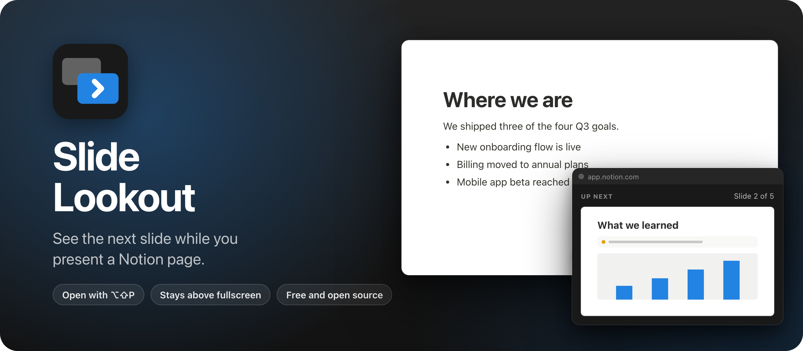
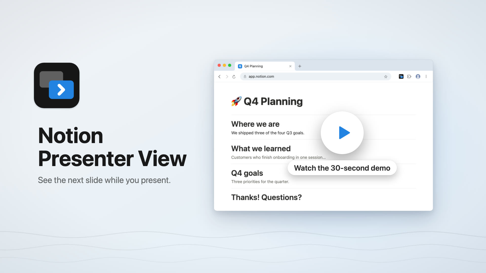

Slide Lookout is a Chrome extension that shows the next slide of a Notion presentation in a small floating window. The window stays on top of the fullscreen slides, so you always know what's coming.

Notion's presentation mode turns a page into slides, split at each divider. You see exactly what the audience sees, one slide at a time. There's no presenter view with the next slide, like Keynote and PowerPoint have, so this extension adds one.

Read the announcement and watch the 30-second demo on my blog: [I built Slide Lookout, a Chrome extension that shows your next slide](https://flaviocopes.com/slide-lookout/).

[](https://flaviocopes.com/slide-lookout/)

## Install

Slide Lookout isn't on the Chrome Web Store, so you load it into Chrome yourself. It takes a minute.

1. Get `Slide-Lookout-1.2.0.zip` from the [latest release](https://github.com/flaviocopes/slide-lookout/releases/latest) and unzip it.
2. Move the `Slide-Lookout-1.2.0` folder somewhere it can stay, like your Documents folder. Chrome runs the extension from that folder, so if you delete it, the extension is gone.
3. Open `chrome://extensions` and turn on **Developer mode** in the top right corner.
4. Click **Load unpacked** and pick that folder.
5. Click the puzzle icon in the toolbar and pin Slide Lookout, so it's one click away.

It needs Chrome 116 or later, and Notion in the browser. Notion's desktop app isn't Chrome, so the extension can't run there.

### Updates

An extension you load this way doesn't update on its own. When there's a new release, unzip it and copy its files into your Slide Lookout folder, replacing the old ones. Then click the reload arrow on its card in `chrome://extensions`. Since the folder is the same, Chrome keeps your shortcut and the pinned button.

To hear about new versions, click **Watch** on this repo, then **Custom** and **Releases**.

## Use it

1. Open the Notion page you want to present.
2. Press `Option+Shift+P` on a Mac (`Alt+Shift+P` on Windows and Linux), or click the extension button. The panel opens.
3. Drag the panel where only you can see it, like your laptop screen while the slides are on the projector.
4. Click the Notion page and press `⌘⌥P` (`Ctrl+Alt+P` on Windows and Linux) to start presenting.

Change slides as usual, with the arrow keys, Space or a clicker. The panel shows the slide that comes next and where you are, like "Slide 3 of 12". On the last slide it tells you the presentation is over. Press the shortcut again to close the panel, or click its close button.

The panel belongs to the Notion tab. When you switch to another tab, window or app, it closes.

### Started without the panel?

If you're presenting and the panel isn't open, move the mouse: an **Open presenter view** button shows up in the bottom right corner. Click it to open the panel. Like Notion's own controls, it fades out when the mouse stops moving.

> When a page opens a floating window, Chrome takes it out of fullscreen. So if you open the panel while the slides are fullscreen, click the slides and press `F` to go back to fullscreen. Open the panel before you start presenting, and this doesn't come up.

The panel has a **Start presenting** button too. Chrome doesn't let a click in the panel make the page fullscreen, so after it starts, click the slides and press `F`.

### The shortcut

To change the shortcut, open `chrome://extensions/shortcuts`. Go there too if the shortcut doesn't work. Chrome skips a suggested shortcut when another extension already uses it, and leaves it empty.

## Features

- The next slide looks the way Notion will draw it on your screen, with its images, callouts and colors, in light or dark mode.
- The panel shows where you are, like "Slide 3 of 12", and tells you when you reach the last slide.
- It stays on top of the fullscreen slides while you're in Notion, and closes when you switch to another tab, window or app.
- If you start presenting without it, a button in the corner opens it.
- If you click the panel, the arrow keys, Space, Page Up, Page Down, Escape and `R` still reach Notion, so your clicker keeps working.
- Embeds show up as a gray box, so a video or a Figma file doesn't load a second time.

## Sharing your screen

The panel is a separate window, so it stays private when you share the Notion tab or the Chrome window in a video call. If you share the whole screen, people see the panel too.

With a projector, set it up as a second display, put the slides on the projector and keep the panel on your laptop. If the displays mirror each other, the audience sees the panel.

## Privacy

Slide Lookout runs on Notion pages only: `notion.so`, `notion.com` and `notion.site`. It needs them to show the **Open presenter view** button while you present, so when you install it, Chrome says it can "read and change your data" on those sites. It also asks for `activeTab` and `scripting`, which let the shortcut and the toolbar button open the panel.

It reads the slides Notion already has in the page and adds the corner button. It doesn't change your pages, it never goes online, and there are no accounts or analytics.

Notion's presentation mode needs a Plus, Business or Enterprise plan. This extension isn't made by or affiliated with Notion.

## Build it from source

There's no build step. Clone the repo and load the folder itself with **Load unpacked**, as in the install steps. After you edit a file, click the reload arrow on the extension's card.

To make the release zip, run:

```sh
scripts/build-release.sh
```

It copies the extension files into `dist/Slide-Lookout-<version>.zip` and prints its SHA-256. The same commit always gives the same zip, so you can check that a release matches its tag.

## Development

The test loads the extension into Playwright's Chromium and goes through a whole presentation on a mock Notion page. It checks the preview, the slide count, the keys forwarded from the panel, the end of the presentation and fullscreen. You need Node.js:

```sh
npm install
npx playwright install chromium
npm test
```

The banner comes from `scripts/banner.html`. Render it again with `npm run banner`. The icons are rendered from `icons/icon.svg` with `npm run icons`.

Working with an AI coding agent? Point it at [AGENTS.md](AGENTS.md). It has the commands and the rules to follow.

## How it works

Notion's presentation mode keeps three slides in the page: the previous one, the current one and the next one. Each sits in an element with a `data-slide-index` attribute, and only the current one has `aria-hidden="false"`. So the next slide is already there, fully drawn, just hidden.

`presenter.js` loads with every Notion page, in the page's own JavaScript world. It checks twice a second whether a presentation is running, and shows the corner button when it is and the panel isn't open.

The shortcut is Chrome's `_execute_action` command, so the button and the shortcut fire the same `action.onClicked` event. When it fires, the service worker in `background.js` runs `toggle.js` in the page with `chrome.scripting.executeScript`. Chrome counts that click or key press as a user gesture in the page, just like a click on the corner button, and the [Document Picture-in-Picture API](https://developer.chrome.com/docs/web-platform/document-picture-in-picture) needs one to open its always-on-top window.

`presenter.js` copies Notion's stylesheets and theme colors into that window, clones the next slide into it and scales it the way Notion scales it on your screen. A `MutationObserver` updates it every time the slide changes. Notion matches its shortcuts on `keyCode`, so the keys you press in the panel are sent to the page as keyboard events with the right `keyCode`. When the page is hidden, or neither the page nor the panel has the focus, the panel closes.

The fullscreen rule comes from Chrome. A page that opens a new window loses fullscreen, and a click in the panel doesn't count as a user gesture in the page. A key press on the slides does, so `F` asks for fullscreen again.

This depends on Notion's markup, so a Notion update can break it. The test's mock page copies that markup from Notion's presentation code.

## License

[MIT](LICENSE)
